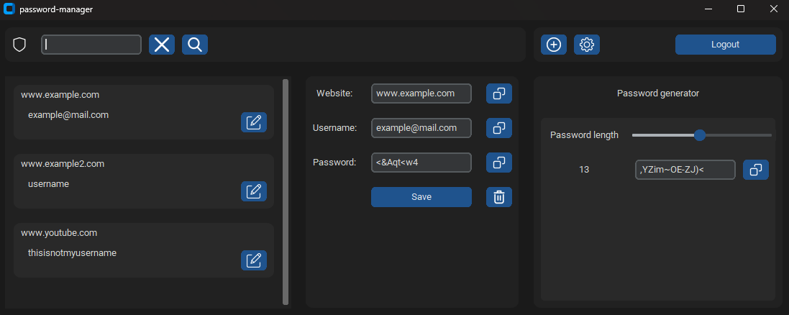

# password-manager
password-manager is a python app made to store user passwords in encrypted database.

## Security
Master password is encrypted with pepper in source code, all other passwords are encrypted with pepper and salt located in db.
